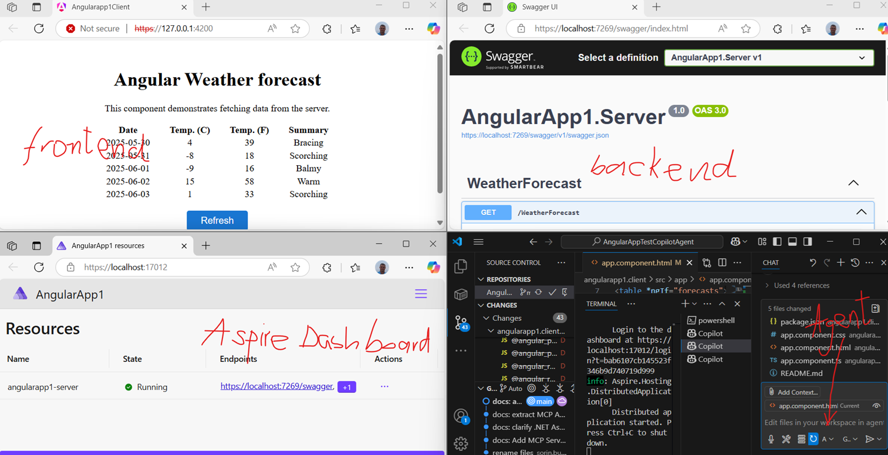

# Solution Overview

This repository contains an ASP.NET Core 8 backend and an Angular 17 frontend application. The backend leverages .NET Aspire, a cloud-ready stack for building distributed applications. Some projects (AppHost and ServiceDefaults) are generated by and required for .NET Aspire orchestration and shared configuration.

## Projects

- **AngularApp1.Server**: ASP.NET Core 8 backend (API)
- **AngularApp1.AppHost**: .NET Aspire AppHost project (purpose: orchestration, entry point for Aspire apps)
- **AngularApp1.ServiceDefaults**: .NET Aspire ServiceDefaults project (purpose: shared service configuration, e.g., logging, health checks, telemetry)
- **angularapp1.client**: Angular 17 frontend application

> **Note:** The AppHost and ServiceDefaults projects are part of the .NET Aspire solution structure. Learn more about .NET Aspire at [https://learn.microsoft.com/dotnet/aspire/overview](https://learn.microsoft.com/dotnet/aspire/overview)

## Getting Started

### Prerequisites
- .NET 8 SDK (ASP.NET Core 8)
- Node.js & npm (for Angular client)
- Angular CLI 17.x (for Angular client)

### Restore Dependencies
- **Backend**: `dotnet restore` in the solution directory or project folder
- **Frontend**: `npm install` in the `angularapp1.client` directory

### Build & Run
- **Backend**: `dotnet build` and `dotnet run` from the server project directory
- **Frontend**: `ng serve` from the `angularapp1.client` directory

## Testing
- **Backend**: `dotnet test`
- **Frontend**: `ng test`

## Contributing
- Follow the coding guidelines in `.github/copilot-instructions.md`
- Write and update tests for all changes

## References
- [Visual Studio MCP Servers Documentation](https://learn.microsoft.com/en-us/visualstudio/ide/mcp-servers?view=vs-2022)
- [YouTube: GitHub Copilot for .NET and Angular](https://www.youtube.com/watch?v=dutyOc_cAEU)
- [Sample Copilot Instructions (GitHub)](https://github.com/burkeholland/the-urlist-web/blob/main/.github/copilot-instructions.md)

## License
Specify your license here.

## MCP Server for GitHub: Setup in Visual Studio Code

See [MCP_GitHub_Server_Setup.md](./MCP_GitHub_Server_Setup.md) for detailed, step-by-step instructions on how to configure and run a Model Context Protocol (MCP) Server for GitHub in Visual Studio Code.

---

## MCP Agent Mode in Visual Studio 2022

See [MCP_AgentMode_VS2022_Setup.md](./MCP_AgentMode_VS2022_Setup.md) for detailed, step-by-step instructions on how to enable and configure Agent Mode with an MCP server in Visual Studio 2022.

---
